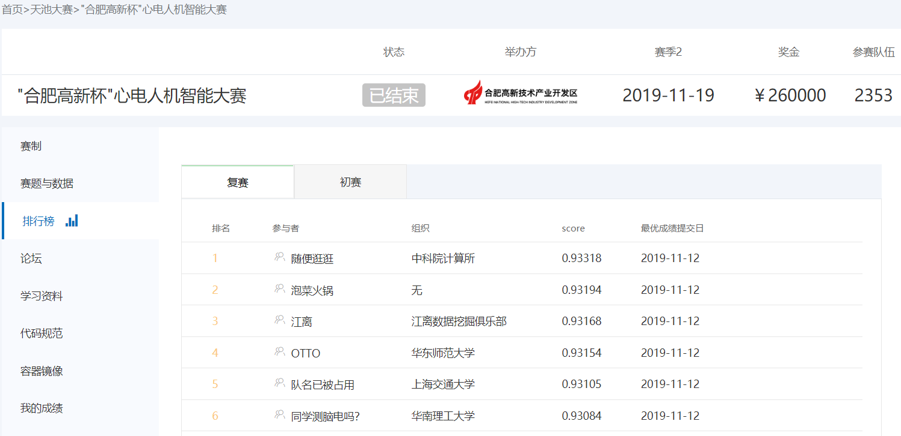
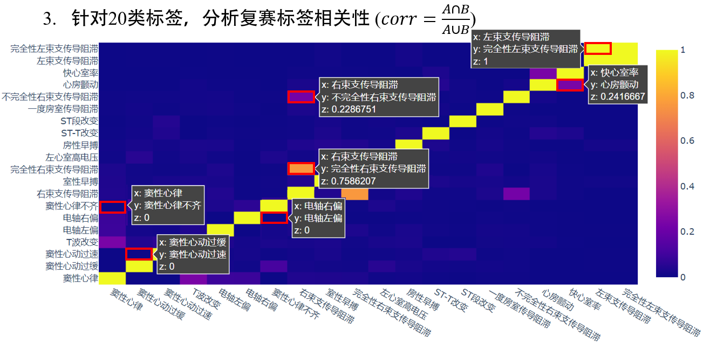
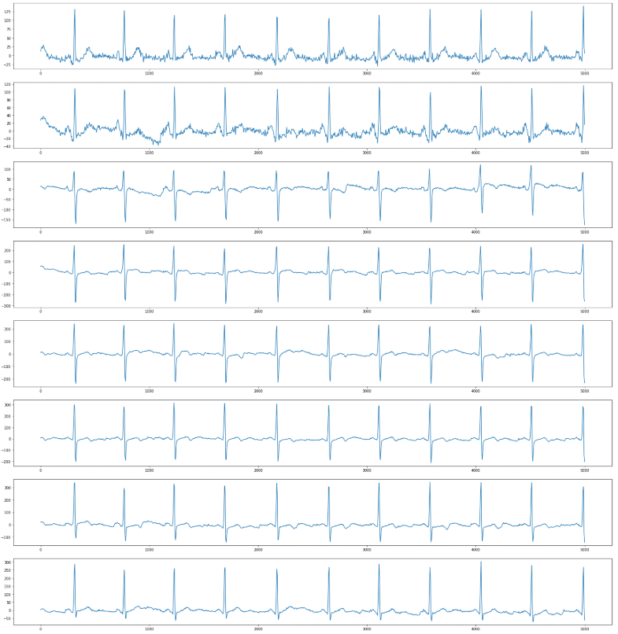
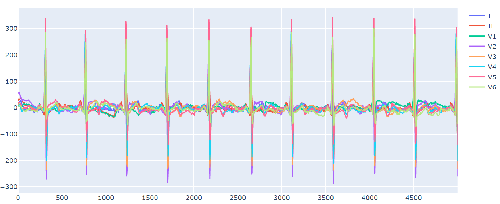
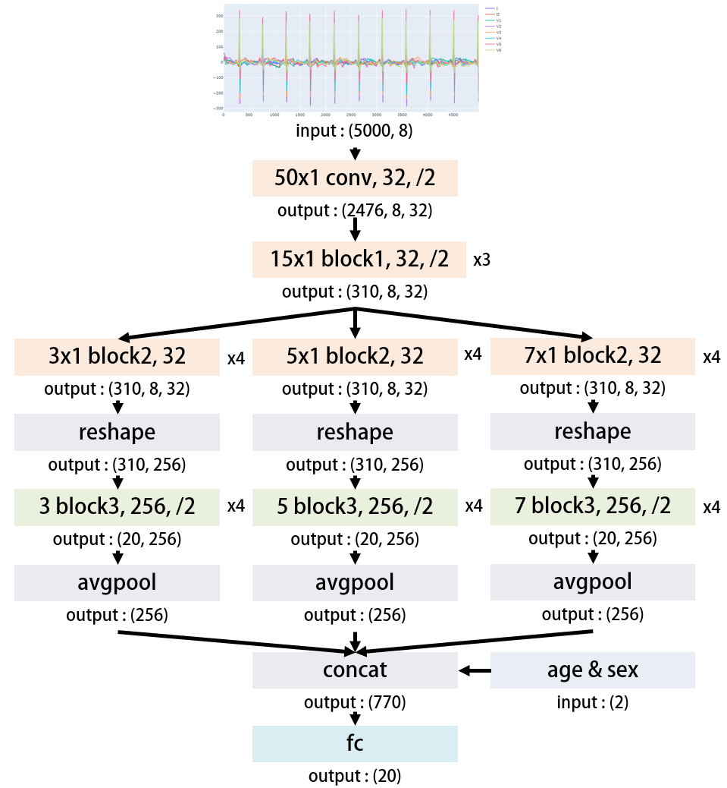
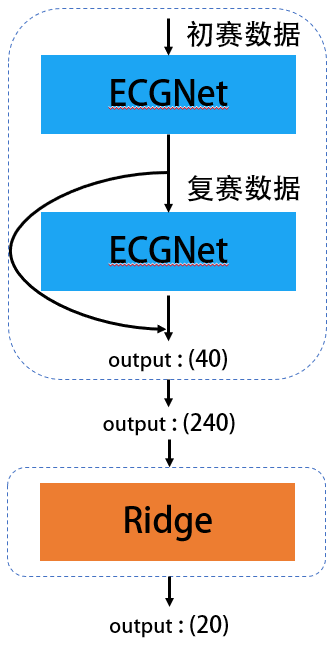
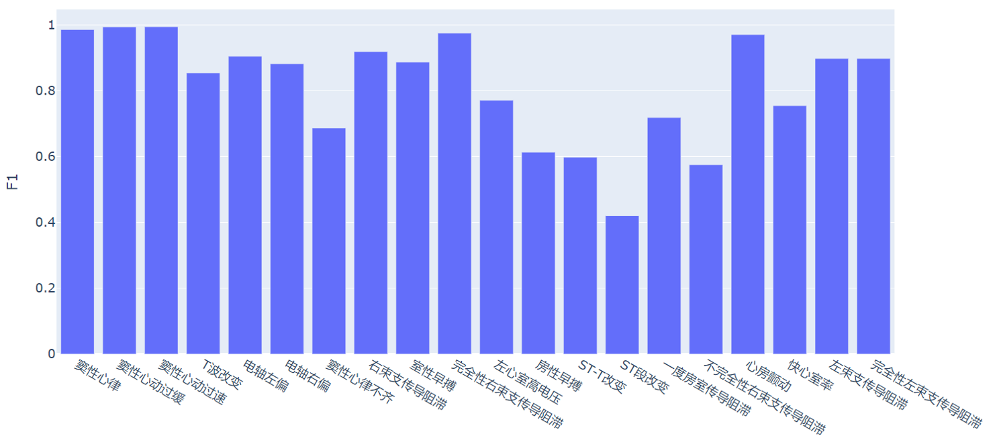

## “合肥高新杯”心电人机智能大赛——心电异常事件预测冠军解决方案
### 赛题地址
https://tianchi.aliyun.com/competition/entrance/231754/introduction  
### 开源baseline
感谢比赛期间JavisPeng开源的优质[baseline](https://github.com/JavisPeng/ecg_pytorch)
### 比赛分数

  

### 赛题回顾
- 问题描述：依据心电图机8导联的数据和年龄、性别特征，预测心电异常事件
- 比赛数据：32142条初赛数据和20036条复赛数据（初赛数据有重复，初复赛标签分布差异大）
- 评价指标：MicroF1
### 数据分析
- 标签相关性：计算公式为两标签交集数量除以两标签并集数量，0表示完全互斥。该相关性也可视为一种“特征”。

  

- 不同导联节拍一致：波峰波谷位置一致。

  

- 不同导联十分相似：将不同导联画在同一坐标轴上，可看出**相似性**。如何构建模型以利用这种**相似性**是**最为关键**的思路。

  

### 模型构建
针对多导联心电图分类任务，我创新地提出一种网络结构，将其称之为ECGNet: Multi-scale ResNet for Multi-lead ECG Data。可以说该模型是本次比赛的**致胜关键**。（细节见PPT）

  

### 模型融合

  

模型融合阶段效果提升有两点原因：
  1. 充分利用初赛和复赛的数据
  2. “隐含”地利用了不同标签的相关性 
  
不足之处：
  1. 模型缺乏多样性
  2. 没有用到传统特征和树模型   
  
此外，植物提出的[嫁接学习](https://github.com/plantsgo/ijcai-2018)也是种很有意思的思路。

### 效果评估
线下对20类标签用单模型评估效果，反正比我自己判断的好得多（仅限电轴偏转方向）

  

### 失败尝试
以下是一些失败的尝试（不代表这些方法真的不行，也许是我的打开方式有问题）：
- 傅里叶变换
- 小波变换
- 频谱图
- DenseNet
- EfficientNet
- Attention
- LSTM
- 滑动窗口
- 去噪
- 特征工程
总之还是要多思考多去尝试吧，没有什么事能一帆风顺的。

### 赛后感想
本次比赛收获颇丰，除了实质性奖励以外，还锻炼了我赛题思考、数据分析、模型构建、论文阅读、编程实现以及答辩的能力，也与其他选手交流了一些优秀的想法。  
本次比赛还是有很大的运气成分的，客观上来看自己还是很菜，还是需要不断努力，再接再厉吧。

### PS
很多细节我没有详细介绍，有兴趣地可以看PPT或答辩视频

### 答辩视频
//TODO
